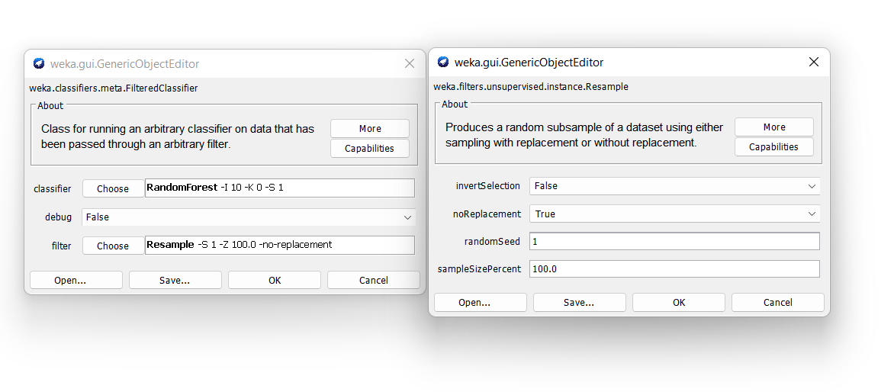

```{r setup, include=FALSE}
knitr::opts_chunk$set(echo = TRUE)
# Chunk caching
knitr::opts_chunk$set(cache = TRUE)
```

```{r, libraries}
## Libraries
options(digits = 3)
library(dplyr)
library(ggplot2)
library(tidyr)
library(readr)
library(gridExtra)
library(GGally)
library(purrr)
library(psych)
library(kableExtra)
library(ggbiplot)
library(png)
library(ggpubr)
library(cowplot)

```

\newpage
# Introduction

Myocardial infraction (MI), is known as heart attacks happens when one or more areas of the heart mucles do not get enough oxygen which can happen when the blood flow of the heart muscle is blocked \cite{hopkins}
MI is one of the most challenging problems of the modern medicine. 
Because the course of disease in patients with MI differs each patient. MI can happen with or without complications that do not affect the long-term prognosis. Approximately half of the patients in the acture and subactute period experience complication that results in worsening of the disease or death. Even an experienced specialist may not be able to predict the development of these complications.
Acute MI is associated with high mortality in the first year after it. The incidence of MI remains high in all countries. This is especially true for the urban population of highly developed countries, which is exposed to chronic stress factors, irregular and not always balanced nutrition. \cite{MLR}

## Data

Myocardial  infarction  complications  Database was collected  in the  Krasnoyarsk Interdistrict Clinical Hospital No20 named after I. S. Berzon (Russia) in 1992-1995.Database  contains  1700  records  (patients),  111  input  features  and  12  complications. In the database contains 7.6% of missing values. 

The codebook for this dataset can be found as a pdf and is available in the repo. Because the data set is large it is difficult to make a codebook from it. 

## Research question

The goal for this research is to answer the question, can you predict the complications of the patients after the third day of the admission based on the admission period and patients data using machine learning?

\newpage
# EDA of myocardial infarction complications data 

Before the data is being visualized, the data is loaded first. After the data is loaded, the data can be used.
```{r load-data, message=FALSE}
# Defining the data file and reading the file
data_file <- "data/Myocardial_infarction_complications_Database.csv"
Myocardial <- read.table(data_file, sep=",", header = TRUE, na.strings = "?")


# Show the data
str(Myocardial)
```
```{r}
# Shows the first 6 rows of the myocardial infraction data set
head(Myocardial)
```

Loading the myocardial as a table to view all the data en giving the summary of the data set.
```{r, summary_data}
# Gives the summary of the data set of Myocardial infraction
summary(Myocardial)
```
The results of the summary shows that there are some columns that hava a lot of missing value's. And that the most of the columns consist of the numbers 0 and 1. Expect for a few other columns, that gives information about the content of the blood and ecg content. 

## Missing NA
To see if there are missing values in this data and giving the precentage of the missing values in data set.
```{r, Table_NA}
# All missing values of the data set
kable(colSums(is.na(Myocardial)), col.names = "Counts of NA's",
      caption = "The counts of NA's of each column")
```
Looking at the table \ref{tab:Table_NA} it shows that the missing values are in examinations which were needed for a patient to see their state at the time of admission. Which explains why there is many missing values, because it doesn't apply for every patient. 

Seeing the results of the table \ref{tab:Table_NA}, it can be concluded that the missing values could be removed from the data set. Because the missing values do not add more information to the analysis. 

\newpage
## Visualizing the data set of myocardial infraction

The selected data is the blood pressures of the patients that has arrived. This violin plot shows the ages which has a higher blood pressure whether it is systolic or diastolic.
```{r, fig.cap="\\label{fig:blood_pressure}Blood pressures of patients according to the ECT (Emergency cardiology team) and ICU (Intensive care unit)", out.height='60%', out.width='75%'}
tmp <- Myocardial %>% select(2, 35:38) %>% drop_na()

df1 <- data.frame(x=tmp$AGE, y=tmp$S_AD_KBRIG)
df2 <- data.frame(x=tmp$AGE, y=tmp$D_AD_KBRIG)
df3 <- data.frame(x=tmp$AGE, y=tmp$S_AD_ORIT)
df4 <- data.frame(x=tmp$AGE, y=tmp$D_AD_ORIT)

ggplot(df1, aes(x,y)) +
  geom_violin(aes(color="Systolic blood pressure of ECT")) +
  geom_jitter(aes(color="Systolic blood pressure of ECT"), 
              alpha=0.4) +
  geom_violin(data=df2,aes(color="Diastolic blood pressure of ECT")) +
  geom_jitter(aes(color="Diastolic blood pressure of ECT"),
              alpha=0.4) +
  geom_violin(data=df3,aes(color="Systolic blood pressure of ICU")) +
   geom_jitter(aes(color="Systolic blood pressure of ICU"),
              alpha=0.4) +
  geom_violin(data=df4, aes(color="Diastolic blood pressure of ICU")) +
   geom_jitter(aes(color="Diastolic blood pressure of ICU"),
              alpha=0.4) +
  xlab("Ages of patients (in years)") +
  ylab("blood pressures (in mmHg)") +
  labs(color="legend")
```

Figure \ref{fig:blood_pressure} shows that there are a few outliers in this selected data set. The distribution is expected because most of the patients could have normal blood pressure. Most of the patients have normal diastolic blood pressure in this case, but the patients who measured the systolic blood pressure have a higher mmHg. This actively demonstrates that their heart pushed a lot of blood out. So when they have higher systolic blood pressure for an extended period, it can increase your risk of strokes and heart disease. 


Making a bar chart to check if the time elapsed from the beginning of the attack of CHD to the hospital of all the patients relates to the risk of strokes or heart diseases.
```{r, fig.cap="\\label{fig:time}Time elapsed from the beginning of the attack of CHD to the hospital", out.width='75%'}
ggplot(Myocardial, aes(x=factor(TIME_B_S))) +
  geom_bar(width = 0.7, fill = "orchid4") +
  xlab("Time elapsed from the start of the attack to the hospital") +
  ylab("Numbers of patients")
```

This bar chart \ref{fig:time} shows that the the time elapsed is higher at the number 2. Number 2 is the time elapsed of 2-4 hours. Which could be concluded that the time elapsed is mostly around the time of 2 tot 4 hours for most of the patients that has been admitted to the hospital. 

Mutating the data of the sex attribute to show a better figure.
```{r}
# Mutating the sex attribute to make it readable.
Myocardial_SEX <- Myocardial %>%
  mutate(SEX = factor(SEX, labels = c("Female", "Male"), levels = c(0, 1)))
```

This figure shows the blood pressure with different sex and ages.
```{r, fig.cap="\\label{fig:ds_bloodpressure} Blood pressure according to the Emergency Cardiology Team (EC) and Intensive Care Unit (IC) with the variables sex and ages", out.width='75%'}
# Plots the blood pressures
SB_EC <- ggplot(Myocardial_SEX, aes(x= S_AD_KBRIG, y=AGE)) +
  geom_jitter(aes(color = SEX), alpha = 0.3) +
  xlab("Systolic bloodpressure\naccording to EC")
DB_EC <- ggplot(Myocardial_SEX, aes(x=D_AD_KBRIG, y=AGE)) +
  geom_jitter(aes(color = SEX), alpha = 0.3) +
  xlab("Diastolic bloodpressure\naccording to EC")
SB_IC <- ggplot(Myocardial_SEX, aes(x=S_AD_ORIT, y=AGE)) +
  geom_jitter(aes(color = SEX), alpha = 0.3) +
  xlab("Systolic bloodpressure\naccording to IC")
DB_IC <- ggplot(Myocardial_SEX, aes(x=D_AD_ORIT, y=AGE)) +
  geom_jitter(aes(color = SEX), alpha = 0.3) +
  xlab("Diastolic bloodpressure\naccording to IC")

# Combine the plots
plot_grid(SB_EC, DB_EC, SB_IC, DB_IC, 
          labels = c("A", "B", "C", "D"),
          label_size = 12)
```

Figure \ref{fig:ds_bloodpressure} shows that most of the males in comparison to the females were younger than 60. And most of the females where older than 60. It could be concluded that the males have more risk to have a strokes or heart diseased at a younger age. 


Before making a figure to show the ages of the patients who had a ECG rhythm at the time of admission to the hospital of a sinus with a heart rate of below 60 to above 90. The data set has to be selected and mutated, to understand the distribution better.

Making a range of the heart rate with the ages of the patients to see if the patients fell in the category of the heart rate below 60, between 60 and 60 and above 90.
```{r, subset_ECG6}
# Making a subset of the ECG to make a violin plot with it.
Myocardial.ECG <- Myocardial %>%
  select("AGE", "ritm_ecg_p_01", "ritm_ecg_p_07", "ritm_ecg_p_08") %>%
  pivot_longer(-AGE, names_to = "sinus_with_a_heart_rate",
               values_to = "heart_rate") %>% drop_na()

# Mutating the heart rate to yes and no, to understand it better
Myocardial.ECG <- Myocardial.ECG %>%
  mutate(heart_rate = factor(heart_rate, labels = c("No","Yes"),
                             levels = c(0, 1)))

head(Myocardial.ECG)
```

This figure will show the distribution of the myocardial infraction heart rate data set. This violin plot will show the distribution of the myocardial infraction heart rate data set of the patients at the time of admission to the hospital.
```{r, fig.cap="\\label{fig:ecg} ECG rhythm at the time of admission to the hospital", out.height='60%', out.width='75%'}
# violin plot of the ECG rhythm
ggplot(Myocardial.ECG, aes(sinus_with_a_heart_rate, AGE, col = heart_rate))+
  geom_violin() +
  geom_jitter(alpha = 0.1) +
  scale_x_discrete(labels = c('heart rate 60-90','heart rate above 90',
                              'heart rate above below 60')) +
  ylab("Ages of the patients (in years)") +
  xlab("ECG rhythm (in sinus)")
```

Figure \ref{fig:ecg} shows that most of the patients didn't have a heart rate below 60 at the time of admission to the hospital. And it shows that most of the patients had a normal heart rhythm at the time of admission, so it could mean they don't have a problem with their heart rate. Patients with a heart rate above 90 should be observed because it could lead to heart diseases if they have an irregular heart rate.

\newpage
### Clustering of the myocardial infraction data set

Making a PCA to show the clustering of the data set.
```{r, fig.cap="\\label{fig:myo_pca}PCA of the classes that were important to see the cluserting of the data were taken and set in a prcomp we could see the variance of our PCA.", out.width='75%', out.height='60%'}
# Selecting the data to make a PCA
rows <- nrow(Myocardial)

myo <- Myocardial %>%
  select(where(function(x){sum(is.na(x))/rows < 0.3})) %>%
  select(-ID) %>%
  select(where(function(x){sum(is.infinite(x)) == 0})) %>%
  select(where(function(x){(sum(x == 0, na.rm=T) / rows) < 0.8})) %>%
  drop_na()

myo_pca <- prcomp(as.matrix(myo),
scale. = T,
center = T)
# Plotting the pca
plot(myo_pca, type = "l")
```

Figure \ref{fig:myo_pca} shows that the variances of the PCA and that it decreases. With the 10-dimensional data, the PCA gives 10 principal components. This helps with organizing the information in Principal components to allow reducing the dimensional without losing information that is needed. 

```{r, summary_PCA}
#shows the summary of PCA of the myocardial infraction
summary(myo_pca)
```

This summary of PCA shows measures of the components. It shows the standard deviation, the proportion of the variance and the cumulative proportion. The proportion of the variance indicates that the data set has a low percentage of variability. This could be seen in the data set. This could be because most of the columns have only two variables, yes or no, in numeric levels, which results in low variability. 

Making a PCA plot with the information of the PCA variances.
```{r, fig.cap="\\label{fig:pca} PCA plot of the myocardial of each complications with taking the group klasses of the causes of the myocardial infraction.", out.height='65%', out.width='75%'}
# Plot the PCA 
g <- ggbiplot(myo_pca, obs.scale = 1, var.scale = 1, ellipse = FALSE, circle = TRUE)
g <- g + scale_color_discrete(name = '') 
g <- g + theme(legend.direction = 'horizontal',
legend.position = 'top')
# Show plot
g
```

Figure \ref{fig:pca} shows a scatter plot of the variances of all the component. IT shows a variation of each principal component of the data where the x-axis shows the number of components and the y-axis shows the amount of variations. But \ref{fig:pca} PC1 explains only 7.7% variations and PC2 explains only 10% variations. So this actively demonstrates that it doesn't show all of the variances of the myocardial infraction data.

\pagebreak
\newpage
# Cleaning the data

To clean the data set, the column that contains NA's and columns that doesn't help with the further research are removed.
```{r}
# Changing the variables names for the column LET_IS (Letsel) 
Myocardial_clean <- Myocardial %>%
  mutate(LET_IS = factor(LET_IS, labels = c("unknown", "cardiogenic shock", "pulmonary edema", "myocardial rupture", "progress of congestive heart failure", "thromboembolism", "asystole", "ventricular fibrillation"), levels = c(0, 1, 2, 3, 4, 5, 6, 7)))

# Removing columns that contains NA's and columns that doesn't give more information to the data set.
Myocardial_clean <- Myocardial_clean[, -c(1, 8, 35, 36, 84, 93, 94, 97, 98, 100, 101, 103, 104, 113:123)]
```

Before the cleaned data is used for Weka, the labels of the gender column has to be changed to Female and Male to make the data set understandable.
```{r}
Myocardial_clean <- Myocardial_clean %>%
  mutate(SEX = factor(SEX, labels = c("Female", "Male"), levels = c(0, 1)))
```

The head of the cleaned data to see the overview of it.
```{r, table_sums}
head(Myocardial_clean)
```

\pagebreak
\newpage
# Determine quality metrics

In this section the quality metrics is going to be determined with the help of the program Weka.
Following a machine learning performance, the accuracy metric, which is the default metric, is displayed. However, there are other metrics that can be used, which are more accurate, and are relevant to the data set.

After a machine learning performance shows the performance an accuracy which is the default metric. But other metrics can be applied and are more accuracy and relevant for the data set. 
For the dataset, there are 8 classes which has been categorized in unknown and all the lethal causes. It is important that these classes are correctly predicted and performed. Because if the test shows that is unknown than you don't want it to be a lethal cause. And when it is unknown you want to take others test to know what it could be other than a lethal cause

Thus, by raising the FP in this study. We don't want those who genuinely have cardiac diseases to be forecasted with the unknown, such as other diseases or doesn't have any conditions. In the confusion matrix, the FN is increased so that that FP decreases. The lethal causes, the TN, and the TP, the unknown, are the outcomes from this data set that we want to maintain. This could be patients that didn't have any lethal reason in the aspect of heart diseases. And the results of the patients may not be related to heart diseases. However, it's also possible that those patients require further study.

As can be seen from table \ref{tab:confusion_matrix}, where the first row represents the predicted class and the second and third rows represent the actual class of the myocardial infarction. Here stand FP by the predicted class unknown but the actual class is a lethal cause. It is crucial that the classification to be precise and quick because, if the test reveals that it is a lethal cause, it must be treated as soon as possible to prevent it from getting worse. Therefore, FP should be increased in a more accurate metric.

```{r confusion_matrix}
# Read confusion matrix csv
matrix <- read.csv("Weka_Data/matrix.csv", sep = ",", header = FALSE)

# Setting rownames and colnames to null
rownames(matrix) <- colnames(matrix) <- NULL
kable(matrix, caption = "Confusion matrix of the myocardial infraction data set") %>%
  kable_styling(latex_options = "HOLD_position")
```


The confusion consist of the following layout in Weka: For this matrix is unknown positive and lethal cause negative. 

=== Confusion Matrix ===  

   a   b   <-- classified as          
  TP  FN |   a = Unknown  
  FP  TN |   b = Lethal cause ()

## Weka

Creating a new csv file of the cleaned data set to use in Weka.
```{r}
# Creating a csv file for Weka
write.csv(Myocardial_clean, "./Data/Myocardial.csv", row.names = FALSE, na = "")
```

In Weka we are going to run a few classifiers and see which one does a good job on the data with the accuracy. Because the class has 8 variables it has to be grouped in two groups. Which I am going to make one which contains the unknown which could mean that there were no causes of the tests. 


## Investigating performance of Machine Learning algorithms

With the clean data set we are going to start investigating the performance of all the standard machine learning algorithms with the standard settings in Weka.

```{r classifiers}
classifiers <- read.csv(file ='Weka_Data/Classifiers.csv', sep = ",", header = TRUE, fileEncoding="UTF-8-BOM")
kable(classifiers, caption = "Classification using cross validation 10-fold") %>%
  kable_styling(latex_options = 'scale_down', position = 'center')


```

The table \ref{tab:classifiers} shows the results of the 8 classifiers from the machine learning algorithm using weka.
The results are shows speed, accuracy,  True Positive (TP), False Positive(FP), True Negative(TN), and False Negative(FN). The speed is shown in seconds, the accuracy is shown in percentages. The last four of the table \ref{tab:classifiers} are part of the confusion matrix in Weka. Because the class that was chosen has 8 classes the classes are categorized in unknown and all the lethal causes.

Looking at the table \ref{tab:classifiers} you could see that there are a few who has a higher accuracy compared to the others. OneR has 88.6% accuracy, RandomForest has 86.1% accuracy and SimpleLogistic has 86.2% accuracy. Because the data is about diseases the RandomForest and SimpleLogistic is a good algorithm to use even though the OneR scored better in accuracy.

With the information of the classifiers we are going to investigate the effect of different algorithms using the Weka experimenter.The ZeroR is the test base and the other algorithms are compared to ZeroR to show the accuracy. 
```{r fig.cap="\\label{fig:experimenter}Accuracy of the algorithms for myocardial infraction. v shows that it is significant higher than the test base, ZeroR and * shows that it is significant lower than ZeroR", out.width="95%"}
knitr::include_graphics("images/experiment_output.png")
```

The image \ref{fig:experimenter} shows the output of the experiment of the same algorithms that are shown in table \ref{tab:classifiers}, but with ten repetitions. And the same three algorithms offer the best accuracy compared to ZeroR. But if you compare to the table \ref{tab:classifiers} it shows that the J48 does it better on the image \ref{fig:experimenter} with five differences. And NaiveBayes does slightly better with 0.3 difference, SMO with 0.2 difference and IBk also with a 0.2 difference if compared to the table \ref{tab:classifiers}.
Expect for RandomForest it does slightly worse with a 0.1 difference.

The two algorithm that are chosen are RandomForest and SimpleLogistic. The reason for this is that they have a good accuracy and for this data set a tree classifiers are a good algorithm to make a decision as if the patient is at risk. And SimpleLogistic is a good classifier to build a linear logistic regression model, so with this model it can help make a best fitting logistic model to use for deciding which lethal cause a patient could have. 

The two algorithms, RandomForest and SimpleLogistic, the cost sensitive of the Myocardial Infraction is made with the settings that is to seen in the image under this.
```{r,fig.cap="\\label{fig:costsensitivesetting}The settings of the CostSensitiveClassifier and of the CostMatrix.", out.width="60%"}
knitr::include_graphics("images/costsensitive_setting.png")
```

The image \ref{fig:costsensitivesetting} shows the settings of the CostSensitiveClassifier and the cost matrix, in which the FP is increased. The minimizeExpectedCost is set to true so that the cost is minimized of the expected misclassification. In the CostMatrixEditor, the FP is adapted to 2.0 to reduce the FP in the cost matrix.

With the settings of the given image \ref{fig:costsensitivesetting} the results of the two algorithms is saved. 
```{r, cost_sensitive}
costsensitive <- read.csv("Weka_Data/CostSensitive.csv", sep = ";",
                          header = TRUE, fileEncoding="UTF-8-BOM")
kable(costsensitive, caption = "CostSensitiveClassifier with the two algorithms" ) %>%
  kable_styling(latex_options = 'scale_down', position = 'center')
```

The table \ref{tab:cost_sensitive} shows the CostSensitiveClassifier for the two algorithms that work the best for the Myocardial Infraction data set, SimpleLogistic and RandomForest. The costMatrix is adapted from 1.0 to 4.0 for each build of the CostSensitiveClassifier. The RandomForest has for each row a different confusion matrix and accuracy. In contrast, SimpleLogistic has the same accuracy for the first two rows but, like the RandomForest different confusion matrix.
The costMatrix cost of the FP is increased in this research. The reason for this is we don't want people who actually have heart diseases to be predicted with the unknown, as in other diseases or doesn't have any diseases. In the confusion matrix, the FN is increased so that that FP decreases. The results that we want to keep with this data set are the lethal causes, the TN, and the true positives, which is the unknown. This could be patients that didn't have any lethal reason in the aspect of heart diseases. And the results of the patients are not related to heart diseases. But it can also be that those patients need more research. 

In table \ref{tab:cost_sensitive} it shows that the RandomForest with the cost adapted to 2.0 the accuracy increases by approximately 0.4, but when the cost is increased to 3.0 and 4.0, the accuracy decreases. But with the algorithm SimpleLogistic, the accuracy is the same for the cost with 1.0 and 2.0, but like the RandomForest, the accuracy decreases. 

\newpage
# Exploring Meta-learners and optimize a selecton of algorithms

Here is the effect of the attribute selection methods investigated and optimized and exploring the meta learners with the Myocardial infraction data set.

## Attribute selection

For the attribute selection it has to be evaluated, each single attribute is evaluated with four evaluators. Which will delete the attribute that doesn't say much about the classes.

The settings for the AttributeSelectedClassifier is to see in the image under this.
```{r, fig.cap="\\label{fig:attribute_settings}The settings of the AtrributeSelectedClassifier", out.width='60%'}
knitr::include_graphics("images/attribute_settings.png")
```

With the settings that shows in image \ref{fig:attribute_settings} has been done with four evaluators. The evaluators are *CorrelationAttributeEval*, *GainRatioAttributeEval*, *InfoGainAttributeEval*, and *OneRAttributeEval*. The method search is set on Ranker for all four evaluators and the two algorithms.
```{r, fig.cap="\\label{fig:attributeselection}The outcome of the evaluators from the AttributeSelectedClassifiers for RandomForest and SimpleLogistc", out.width='60%'}
# Reads the png files to create images
correclation <- readPNG("images/Correlation.png")
gain_ratio <- readPNG("images/GainRatio.png")
info_ratio <- readPNG("images/InfoGain.png")
oner <- readPNG("images/OneR.png")

# Plots each image and combines it into one

cor <- ggplot() +
  annotation_custom(rasterGrob(correclation))
gain <- ggplot() +
  annotation_custom(rasterGrob(gain_ratio))
info <- ggplot() +
  annotation_custom(rasterGrob(info_ratio))
one <- ggplot() +
 annotation_custom(rasterGrob(oner))

# Combines the images
plot_grid(cor, gain, info, one, labels = c("A", "B", "C", "D"))
```

The image \ref{fig:attributeselection} shows for every evaluator the ranked attributes and the selected attributes for both RandomForest and SimpleLogistic because the outcome of both the algorithms was the same one of the algorithm is shown. There are many attributes in this data set, so the image shows the best ranked. The subfigure \ref{fig:attributeselection}A shows the output of the evaluator Correlation indexed with the ranking filter and the selected attributes. The ranked attributes show the correlation with the attributes from high to low, the K_SH_POST, cardiogenic shock at the time of admission to intensive care unit, delivers the highest correlation from the data set and the second with the highest correlation is D_AD_ORIT, diastolic blood pressure according to the intensive care unit. And the third with the highest correlation is S_AD_ORIT, systolic blood pressure according to the intensive care unit. The subfigure \ref{fig:attributeselection}B shows the output of the Gain Ratio ranked with the ranking filter and the selected attributes. The subfigure \ref{fig:attributeselection}C shows the Information Gain ranked with the ranking filter and the selected attributes. The subfigure shows the OneR ranked and the desired attributes' percentage with the evaluator's ranking filter.

These three have the highest correlation in the evaluator Correlation, Gain Ratio, and Information Gain, and OneR is in the top 6 with the highest correlation. This can mean that the three can possibly help to predict if a person has heart disease or not.


For further investigation of the AttributeSelection the evaluator CfsSubsetEval is selected to evaluate the worth of the subset of attributes by considering the individual predictive ability of each features. The settings of the CfsSubsetEval is kept the same. The searches for this evaluator RankSearch and BestFirst is selected. For the RankedSerach the attributeEvaluator GainRatio is chosen.

```{r, fig.cap="\\label{fig:subseteval}The settings of the AttributeSelection with the evaluator CfsSubsetEval with the settings of the RankSearch", out.width='60%'}
knitr::include_graphics("images/subset_settings.png")
```

Image \ref{fig:subseteval} shows the settings of the evaluator and search. The other settings are the standard settings for the AttributeSelectedClassifier.

The GainRatio is chosen for the RankSearch is because the GainRatio evaluates the worth of the data set attribute by measuring the gain ratio.

```{r, subset}
subset <- read.csv(file = "Weka_Data/subseteval.csv", sep = ";", header = TRUE, row.names =NULL)
kable(subset, caption = "Evaluator CfsSubsetEval with the searchs RankSearch and BestFirst to evaluate the attributes") %>%
  kable_styling(latex_options = 'scale_down', position = 'center')
```

The search BestFirst with both the classifiers shows an increase of the accuracy. But with the search RankSearch, shows for both Classifiers the same accuracy.
The results of the CfsSubsetEval show that it selected the same attributes for the classifiers RandomForest ad SimpleLogistic. After looking at attributes, it has been decided to choose the attributes to create a better algorithm. To verify the selected attributes, the Select attributes in Weka has been used with the evaluator CfsSubsetEval and with the search Method RankSearch with cross-validation 10-folds. The same chosen attributes have been selected, and the attribute SEX. The rest of the attributes have been deleted, and the file has been saved. With the new myocardial infraction data set the further investigation will take place.


## Meta learners

The meta learners are stacking, boosting and bagging with these were are going to investigate the myocardial infraction data set.

First the Paired T-Tester and the paired T-Tester (corrected) has been runned on the data set and both show the same effect in the experimenter for the algorithms RandomForest and SimpleLogistic. For both statistical tests has RandomForest an accuracy of 85,98%, whereas SimpleLogistic has an accuracy of 86.26%. The RandomForest has an lower accuracy than in table \ref{tab:classifiers} while SimpleLogistic has like in the table \ref{tab:classifiers} an accuracy of 86.26%.

```{r, metalearners}
meta_learners <- read.csv("Weka_Data/meta_learners.csv", sep = ";", header = TRUE,
                          fileEncoding="UTF-8-BOM")
kable(meta_learners, caption = "Meta Leaners with the cross validation 10-fold and with 10 repetitions") %>% kable_styling(latex_options = 'scale_down', position = 'center')

```

The table \ref{tab:metalearners} shows the outcome of the meta learners with the cross-validation 10-fold. The algorithm Bagging with the classifiers shows that the accuracy for both is lower than the accuracy in table \ref{tab:classifiers}, which could mean that the Bagging is not a good algorithm for this data set. For the rest of the algorithm, the accuracy is higher or the same as in the table \ref{tab:classifiers}. With the Bagging Algorithm, there is to see that for the classifier SimpleLogisitic TN is higher than in the table \ref{tab:classifiers}, this means that there are more patients that have heart disease. The algorithm Boosting does it better with the classifier RandomForest, the accuracy of the RandomForest is higher than in the table \ref{tab:classifiers}, but for the classifiers SimpleLogistic, the algorithm Boosting does not have any effect on the accuracy, TP, FP, FN, and TN.

The Stacking algorithm does it better for both MetaClassifier RandomForest and SimpleLogistic. The accuracy is higher than in the table \ref{tab:classifiers} and the TN has increased too. We want to know in this data set if a person has a probability of having heart disease. This means that the TN increase could be a good result and because the TP hasn't changed or not much, it could mean that the Stacking is a good algorithm for the data set. Table \ref{tab:classifiers} shows that the accuracy for the algorithm Vote for both CombinationRule are the same. So the algorithm Vote does not show any improvement for the data set.


\newpage
# ROC and learning curve analysis

In this the the Receiver Operating Characteristics (ROC) curve is being visualized of the algorithm with the optimal settings. With the results the learning curve is made to get a a good performance estimate for the Myocardial Infraction data set.

## ROC curve analysis

For both algorithms, RandomForest and SimpleLogistic, the ROC curves are visualized. The ROC curve is a graphical plot that illustrates the performance of the classification model as its threshold varies.

The following section visualizes Receiver Operating Characteristics (ROC) curves for both RandomForest and SimpleLogistic ROC curve is a graph showing the performance of a classification model at all threshold settings. The ROC curve is created by plotting the True Positive Rate (TPR) against the False Positive Rate (FPR), where TPR is on the y-axis and FDR is on the x-axis.

ROC curve for the classifier RandomForest and SimpleLogistic with the curve of all the threshold setting with the class attribute cardiogenic shock, because the cost matrix shows that the true negatives are mostly the cardiogenic shock.

In Weka the ROC curve of RandomForest and SimpleLogistic are visualized.
```{r, fig.cap="\\label{fig:roccurve}The outcome of the ROC curve threshold visualizer for both the classifiers RandomForest and SimpleLogistic", out.height='60%'}
# Reads the png files to create images
roc_rf <- readPNG("images/roc_rf.png")
roc_sl <- readPNG("images/roc_sl.png")

# Plots each image and combines it into one
rf <- ggplot() +
  annotation_custom(rasterGrob(roc_rf))
sl <- ggplot() +
  annotation_custom(rasterGrob(roc_sl))

# Combines the images
plot_grid(rf, sl, labels = c("RandomForest", "SimpleLogistic"))
```

Figures \ref{fig:roccurve} shows both visualizations of the threshold setting of the attribute cardiogenic shock.

The data is plotted in a figure with the ROC curve data of the classifiers RandomForst and SimpleLogistic.
```{r, fig.cap="\\label{fig:roc_curve} ROC curve for the classifiers RandomForest and SimpleLogistic at all threshold setting with the attribute cardiogenic shock"}

# Read the roc curve data of RandomForest and SimpleLogisitic
roc_data_randomforest <- read.table("Weka_Data/roccurve_randomforest.arff",
                                    sep = ",", comment.char = "@")
roc_data_simplelogistic <- read.table("Weka_Data/roccurve_simplelogistic.arff",
                                    sep = ",", comment.char = "@")

# Defining the names the roc data for RandomForest
names(roc_data_randomforest) <- c("Instance_number", "True_Positives", "False_Negatives",
                         "False_Positives", "True_Negatives", 
                         "False_Positive_Rate", "True_Positive_Rate", 
                         "Precision", "Recall", "Fallout", "FMeasure", 
                         "Sample_Size", "Lift", "Threshold")


# Assign colors for the classifier and threshold
colors <- c(classifier ="orange", threshold = "blue")

# Plot the ROC Curve of RandomForest
roc_randomforest <- ggplot(data = roc_data_randomforest, mapping = aes(x = False_Positive_Rate, 
                                             y = True_Positive_Rate)) +
  geom_point(mapping = aes(color = "classifier")) +
  geom_line(aes(color = "classifier")) +
  geom_abline(aes(color = "threshold", slope = 1, intercept = 0)) +
  scale_color_manual(values = colors) +
  ggtitle("RandomForest") +
  xlab("False Positive Rate") +
  ylab("True Positive Rate") +
  theme_pubr() +
  theme(legend.title = element_blank())

# Define the names for SimpleLogistic
names(roc_data_simplelogistic) <- names(roc_data_randomforest)

# Plot the ROC Curve of SimpleLogistic
roc_simplelogistic <- ggplot(data = roc_data_simplelogistic, mapping = aes(x = False_Positive_Rate, 
                                             y = True_Positive_Rate)) +
  geom_point(mapping = aes(color = "classifier")) +
  geom_line(aes(color = "classifier")) +
  geom_abline(aes(color = "threshold", slope = 1, intercept = 0)) +
  scale_color_manual(values = colors) +
  ggtitle("SimpleLogistic") +
  xlab("False Positive Rate") +
  ylab("True Positive Rate") +
  theme_pubr() +
  theme(legend.title = element_blank())

# Combine ROC Curve of RandomForest and SimpleLogistic plots
combined_roccurve <- plot_grid(roc_randomforest + theme(legend.position = "none"),
                               roc_simplelogistic + theme(legend.position = "none"),
                               labels = c("A", "B"), label_size = 12)
# Create legend
legend <- get_legend(roc_simplelogistic + guides(color = guide_legend(nrow = 1)))

# Plot the combined plots
plot_grid(combined_roccurve, legend, ncol = 1)

```

In figure \ref{fig:roc_curve} there are two figures with a ROC curve. The first one figure \ref{fig:roc_curve}A shows the ROC curve from the algorithm RandomForest and the second figure \ref{fig:roc_curve}B shows the ROC curve from the algorithm SimpleLogistic. The TPR is plotted against the FPR at various thresholds, forming a line when the dots joins. The area under the ROC curve shown in orange is called the Area Under The Curve (AUC) curve. The blue threshold line shown in the figures is straight, the predicted observation probability. Figure \ref{fig:roc_curve}A line classifier has dots that are connected, and between the dots at the end, the dots are connected. The line has almost a line of 90 degrees and a straight angle. This shows that the curve is ideal because the two curves of TP and TN almost do not overlap. The reason for it is that it is perfectly able to distinguish between positive class and negative class. If the two curves overlap, the type 1 and type 2 errors are introduced, and the model runs in a curve or a straight line like the threshold line.
The ROC curve of SimpleLogistic is shown in figure \ref{fig:roc_curve}B, and the TPR is plotted against the FPR. Both threshold lines of the ROC curve RandomForest and SimpleLogistic are the same. The most significant difference between the two figures is that the ROC curve of the RandomForest line compared to the ROC curve of SimpleLogistic is slightly straighter. This means that the ROC curve RandomForest figure \ref{fig:roc_curve}A has almost an ideal situation because there is virtually no overlap. This the ROC curve of RandomForest is slightly better than SimpleLogistic. In Weka, the SimpleLogistic has the AUC value of 0.842, and the AUC value of RandomForest is 0.890. This will be indicated that the ROC curve of RandomForest is better than SimpleLogistic because the AUC of RandomForest is closer to one which categories as perfect. 


# Learning curve

The RandomForeset came out as the best with the standard settings from all the algorithms, so for the next section, a learning curve is created with RandomForst as the classifier.

```{r, fig.cap="\\label{fig:learningimage}The settings of classifier FilteredClassifier to create a learning curve.", out.width="75%"}

```

Image \ref{fig:learningimage} shows the settings of the FilteredClassifier. The classifier is FilteredClassifier under meta. The chosen classifier in the FilteredClassifier is RandomForest and as filter Resample is chosen. The noReplacement is set to true so there are no replacemenets and the sampleSizePercent differs from 0% to 100% as seen in the right side of the image \ref{fig:learningimage}.

```{r learning, fig.cap="\\label{fig:learningcurve}Learning curve of the accuracy for different sample size percentages compared to the baseline zeroR.", out.width="75%"}
learning_data <- read.csv("Weka_Data/learning_curve.csv", header = TRUE, 
                          sep = ",")
kable(learning_data, caption = "Accuracy of the FilteredClassifier with
      different sampleSizePercent") %>%
  kable_styling(latex_options = "HOLD_position")

# Plotting the learning curve
ggplot(learning_data, aes(x = sampleSizePercent, y = Accuracy)) +
  geom_point(colour = "darkgreen") +
  geom_line(colour = "darkgreen") +
  geom_hline(yintercept = 65, linetype ="dashed", color = "darkblue") +
  theme_minimal() +
  labs(title="Learning curve", x="Sample Size Percent (%)", y="Accuracy (%)") +
  scale_x_continuous(breaks = seq(0, 100, 10)) +
  scale_y_continuous(breaks = seq(50, 100, 5))
```

The table \ref{tab:learning} contains two columns with the sample size percent and the second column gives the accuracy for different sample size percentages from the classifier FilteredClassifier. Here can been seen that the accuracy of 1% to 100% is it increasing. However from 1% to 5% sample size percent the accuracy was increasing, but when it hits the 10% sample size percent the accuracy decreases with 1%. Afterwards it was increasing till it hits the mark of 100% sample size percent, so the highest is accuracy is for 100% of the sample size which is 98.5%. These values create a learning curve together which is shown in figure \ref{fig:learningcurve}. Figure \ref{fig:learningcurve} has a green line with points which shows the accuracy for the different sample size percentages of RandomForest and the dashed blue line shows the baseline which is the accuracy of ZeroR for every percentage. The accuracy of ZeroR is the same because is the simplest classification method that relies only on predicting the class and ignores all attributes. And ZeroR has thus for all percentages the same accuracy. Compared to the baseline of ZeroR the RandomForest has a much higher accuracy. RandomForest shows a smooth linear increase. To get a reasonable performance there is at least 80% of the data needed, because from 80% it is above 95% accuracy and below 80% of the sample size it is lower than 95% accuracy. But for 100% of the sample size has RandomForest an accuracy of 98.5%. So there is at least 80% of the data needed to get a reasonable performance and to get a better performance 100% of the data is needed.


\newpage
\begin{thebibliography}{9}
\bibitem{hopkins}
Johns Hopkins medicine: \textit{Heart attack}, Conditions and Diseases, Retrieved from https://www.hopkinsmedicine.org/health/conditions-and-diseases/heart-attack on 4-10-2021

\bibitem{MLR}
Machine learning repository: \textit{Machine Learning}, Myocardial infraction complications data set, Retrieved from https://archive.ics.uci.edu/ml/datasets/Myocardial+infarction+complications on 09-12-2020

\end{thebibliography}


